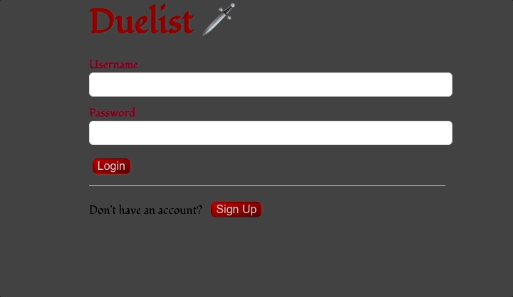
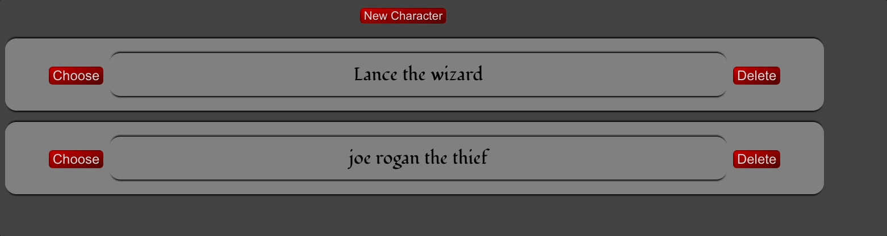
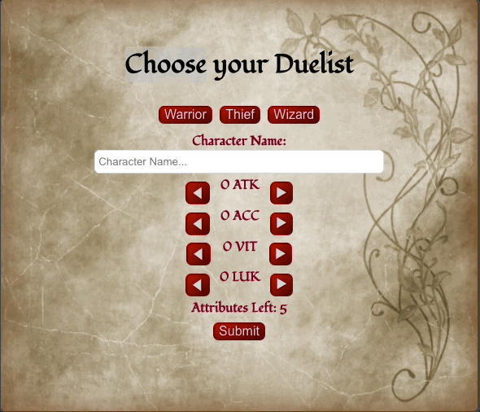
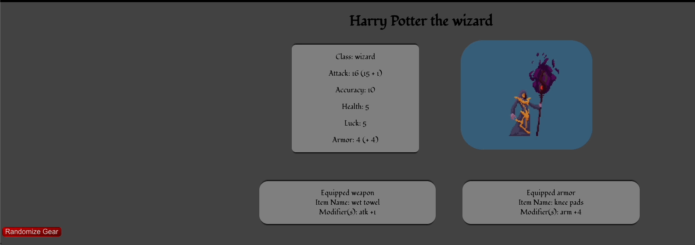
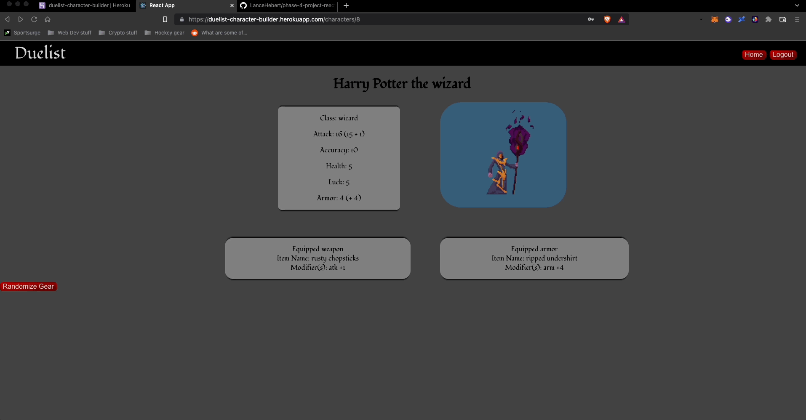

# Duelist

## Description

- Made in 1 week, Group Project - Contributors   [1NJ57C3](https://github.com/1NJ57C3),[Nick Alayra](https://github.com/nalayra)

This project is a dungeons and dragons inspired character builder. The app currently is able to auth users and save the character they make to a rails backend using the MVC model. Duelist allows you to create a character with certain attributes, receive randomized starter gear with stats that dynamically update your character attributes and displays a fun sprite image with varying animations.

## Features of this App

***

***
- Authentication for user log in and persistent database
 ***

***
- Drag and Drop character select 
***

***
- Attribute selection with boundary handling and limited stat pool from a template based on class
***

***
- Receive randomized gear with differing rarities. User also has ability to reroll armor and weapon
***

***
- Lightbox display when character sprite is clicked on with sprite animations

## Technology Used

- Ruby on Rails
- React javascript
- SQL
- [Styled Components](https://styled-components.com/),[React-Router](https://reactrouter.com/),[React Beautiful DnD](https://github.com/atlassian/react-beautiful-dnd) 

